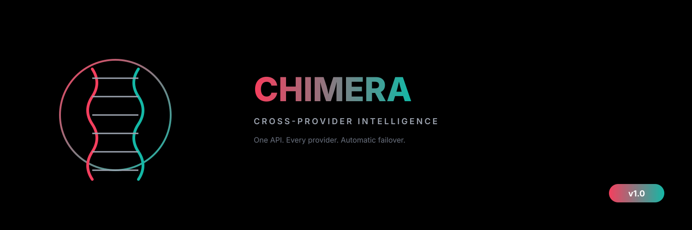
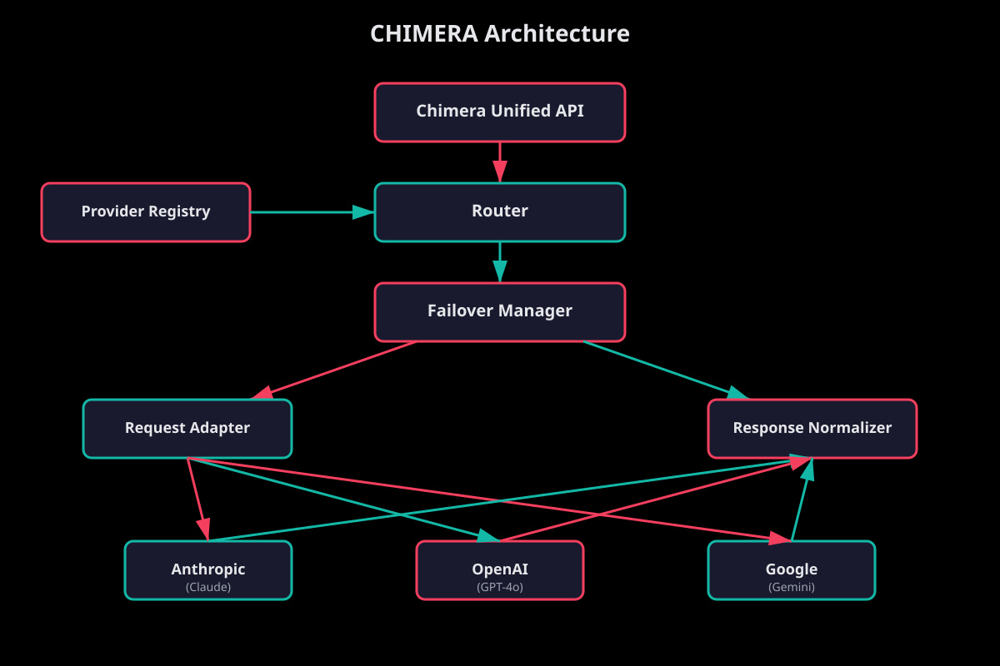

<div align="center">

**CROSS-PROVIDER INTELLIGENCE**

*One API. Every provider. Automatic failover.*


</div>

---

## What is Chimera?

**Chimera** is a cross-provider AI intelligence layer. Write your code once and seamlessly route requests across Anthropic (Claude), OpenAI (GPT-4o), and Google (Gemini) — with intelligent routing, automatic failover, and normalized responses.

## Why Chimera?

In Greek mythology, the Chimera was a fearsome hybrid creature — part lion, part goat, part serpent — combining the most powerful traits of different beasts into one being. CHIMERA embodies this principle of cross-provider fusion: it combines Anthropic's reasoning depth, OpenAI's versatility, and Google's speed into a single unified interface. Like the mythological creature that was greater than the sum of its parts, CHIMERA's intelligent routing and automatic failover create a system more resilient and capable than any single provider alone.

## Features

- **Unified API** — Single interface for Anthropic, OpenAI, and Google AI
- **Smart Routing** — Route by quality, cost, latency, balanced scoring, or round-robin
- **Automatic Failover** — Retry with exponential backoff, failover to next provider
- **Circuit Breaker** — Automatically isolate unhealthy providers
- **Response Normalization** — Consistent response format regardless of provider
- **Tool/Function Calling** — Unified tool interface across all providers
- **Extensible** — Register custom providers with custom adapters/normalizers
- **Zero Dependencies** — Pure Node.js, uses native `fetch`

## Quick Start

```js
import Chimera from 'chimera';

const chimera = new Chimera({
  apiKeys: {
    anthropic: process.env.ANTHROPIC_API_KEY,
    openai: process.env.OPENAI_API_KEY,
    google: process.env.GOOGLE_API_KEY,
  },
});

// Simple ask — routes to best available provider
const response = await chimera.ask('Explain quantum computing in one paragraph');

console.log(response.content);    // The response text
console.log(response.provider);   // Which provider handled it
console.log(response.usage);      // Token usage (normalized)
```

## Routing Strategies

```js
import Chimera, { Strategy } from 'chimera';

const chimera = new Chimera();

// Route by quality (picks Anthropic — highest quality score)
chimera.setStrategy(Strategy.QUALITY);

// Route by cost (picks Google — cheapest)
chimera.setStrategy(Strategy.COST);

// Balanced (default) — weighted quality + cost
chimera.setStrategy(Strategy.BALANCED);

// Route by latency — picks fastest recent responder
chimera.setStrategy(Strategy.LATENCY);

// Round robin — distribute evenly
chimera.setStrategy(Strategy.ROUND_ROBIN);

// Force a specific provider
const response = await chimera.chat(
  { messages: [{ role: 'user', content: 'Hello' }] },
  { provider: 'anthropic' }
);
```

## Full Chat Example

```js
const response = await chimera.chat({
  messages: [
    { role: 'system', content: 'You are a helpful coding assistant.' },
    { role: 'user', content: 'Write a fibonacci function in Python' },
  ],
  maxTokens: 2048,
  temperature: 0.3,
  tools: [{
    name: 'run_code',
    description: 'Execute Python code',
    parameters: {
      type: 'object',
      properties: { code: { type: 'string' } },
    },
  }],
});

// Unified response format — same shape regardless of provider
console.log(response.id);            // 'msg_abc123'
console.log(response.provider);      // 'anthropic'
console.log(response.model);         // 'claude-sonnet-4-6'
console.log(response.content);       // The text response
console.log(response.finishReason);  // 'stop' | 'max_tokens' | 'tool_use'
console.log(response.toolCalls);     // [{ id, name, arguments }]
console.log(response.usage);         // { inputTokens, outputTokens, totalTokens }
console.log(response.latencyMs);     // 450
```

## Failover in Action

```js
// If Anthropic is down, automatically tries OpenAI, then Google
const chimera = new Chimera({
  failoverOpts: {
    maxRetries: 3,            // Retries per provider
    retryDelayMs: 1000,       // Initial retry delay
    backoffMultiplier: 2,     // Exponential backoff
    circuitThreshold: 5,      // Failures before circuit opens
    circuitResetMs: 60000,    // Time before retrying open circuit
  },
});

const response = await chimera.ask('Hello!');
// Even if the primary provider fails, you get a response
```

## Custom Providers

```js
chimera.registerProvider(
  'mistral',
  {
    name: 'Mistral AI',
    baseUrl: 'https://api.mistral.ai/v1',
    models: ['mistral-large-latest'],
    authHeader: 'Authorization',
    authPrefix: 'Bearer ',
    capabilities: ['chat', 'streaming', 'tool_use'],
    costPer1kInput: 0.004,
    costPer1kOutput: 0.012,
    qualityScore: 80,
  },
  // Custom request adapter
  (req) => ({
    url: '/chat/completions',
    method: 'POST',
    headers: { 'content-type': 'application/json' },
    body: { model: req.model, messages: req.messages },
  }),
  // Custom response normalizer
  (raw, meta) => ({
    id: raw.id,
    provider: 'mistral',
    model: raw.model,
    content: raw.choices?.[0]?.message?.content || '',
    role: 'assistant',
    finishReason: 'stop',
    toolCalls: [],
    usage: { inputTokens: 0, outputTokens: 0, totalTokens: 0 },
    latencyMs: meta.latencyMs || 0,
    raw,
  }),
);
```

## CLI

```bash
# Show provider status
chimera status

# List all providers
chimera providers

# Send a quick prompt
chimera ask "What is the meaning of life?"
```

## Architecture



## Project Structure

```
chimera/
├── lib/
│   ├── provider-registry.mjs    # Provider management
│   ├── request-adapter.mjs      # Request translation
│   ├── response-normalizer.mjs  # Response normalization
│   ├── router.mjs               # Intelligent routing
│   ├── failover.mjs             # Retry & circuit breaker
│   └── unified-api.mjs          # Main Chimera class
├── test/
│   ├── provider-registry.test.mjs
│   ├── request-adapter.test.mjs
│   ├── response-normalizer.test.mjs
│   ├── router.test.mjs
│   ├── failover.test.mjs
│   └── unified-api.test.mjs
├── bin/
│   └── cli.mjs                  # CLI interface
├── docs/
│   ├── architecture.md          # Architecture & diagrams
│   └── api-reference.md         # Full API documentation
└── package.json
```

## Test Suite

```bash
npm test
# 83 tests across 6 test suites — all passing
```

## License

MIT
